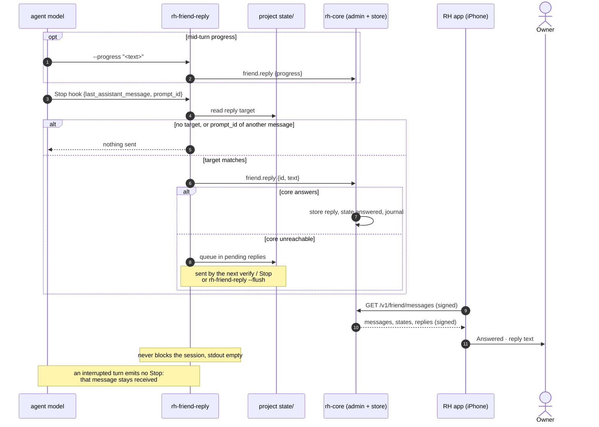

# friend.reply: the agent's answer to the phone

```mermaid
sequenceDiagram
    autonumber
    participant Model as agent model
    participant Reply as rh-friend-reply
    participant State as project state/
    participant Core as rh-core (admin + store)
    participant App as RH app (iPhone)
    actor Owner

    opt mid-turn progress
        Model->>Reply: --progress "<text>"
        Reply->>Core: friend.reply {progress}
    end
    Model->>Reply: Stop hook {last_assistant_message, prompt_id}
    Reply->>State: read reply target
    alt no target, or prompt_id of another message
        Reply-->>Model: nothing sent
    else target matches
        Reply->>Core: friend.reply {id, text}
        alt core answers
            Core->>Core: store reply, state answered, journal
        else core unreachable
            Reply->>State: queue in pending replies
            Note over Reply,State: sent by the next verify / Stop<br/>or rh-friend-reply --flush
        end
    end
    App->>Core: GET /v1/friend/messages (signed)
    Core-->>App: messages, states, replies (signed)
    App->>Owner: Answered · reply text
    Note over Reply: never blocks the session, stdout empty
    Note over Model,Reply: an interrupted turn emits no Stop:<br/>that message stays received
```
