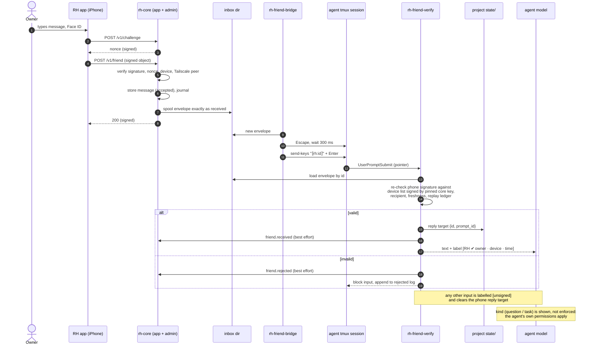

# friend.send: phone message to the agent session

```mermaid
sequenceDiagram
    autonumber
    actor Owner
    participant App as RH app (iPhone)
    participant Core as rh-core (app + admin)
    participant Inbox as inbox dir
    participant Bridge as rh-friend-bridge
    participant Tmux as agent tmux session
    participant Verify as rh-friend-verify
    participant State as project state/
    participant Model as agent model

    Owner->>App: types message, Face ID
    App->>Core: POST /v1/challenge
    Core-->>App: nonce (signed)
    App->>Core: POST /v1/friend (signed object)
    Core->>Core: verify signature, nonce, device, Tailscale peer
    Core->>Core: store message (accepted), journal
    Core->>Inbox: spool envelope exactly as received
    Core-->>App: 200 (signed)
    Bridge->>Inbox: new envelope
    Bridge->>Tmux: Escape, wait 300 ms
    Bridge->>Tmux: send-keys "⟦rh:id⟧" + Enter
    Tmux->>Verify: UserPromptSubmit (pointer)
    Verify->>Inbox: load envelope by id
    Verify->>Verify: re-check phone signature against<br/>device list signed by pinned core key,<br/>recipient, freshness, replay ledger
    alt valid
        Verify->>State: reply target {id, prompt_id}
        Verify->>Core: friend.received (best effort)
        Verify-->>Model: text + label [RH ✔ owner · device · time]
    else invalid
        Verify->>Core: friend.rejected (best effort)
        Verify-->>Tmux: block input, append to rejected log
    end
    Note over Verify,Model: any other input is labelled [unsigned]<br/>and clears the phone reply target
    Note over Model: kind (question / task) is shown, not enforced:<br/>the agent's own permissions apply
```
