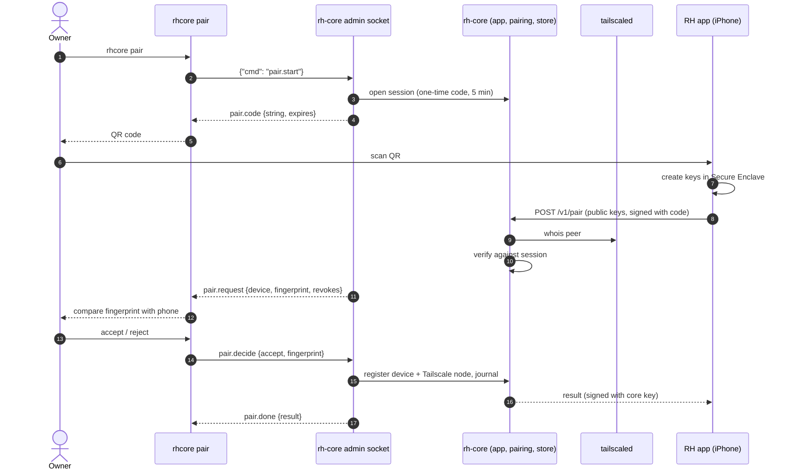

# Pairing a phone

```mermaid
sequenceDiagram
    autonumber
    actor Owner
    participant CLI as rhcore pair
    participant Admin as rh-core admin socket
    participant Core as rh-core (app, pairing, store)
    participant TS as tailscaled
    participant App as RH app (iPhone)

    Owner->>CLI: rhcore pair
    CLI->>Admin: {"cmd": "pair.start"}
    Admin->>Core: open session (one-time code, 5 min)
    Admin-->>CLI: pair.code {string, expires}
    CLI-->>Owner: QR code
    Owner->>App: scan QR
    App->>App: create keys in Secure Enclave
    App->>Core: POST /v1/pair (public keys, signed with code)
    Core->>TS: whois peer
    Core->>Core: verify against session
    Admin-->>CLI: pair.request {device, fingerprint, revokes}
    CLI-->>Owner: compare fingerprint with phone
    Owner->>CLI: accept / reject
    CLI->>Admin: pair.decide {accept, fingerprint}
    Admin->>Core: register device + Tailscale node, journal
    Core-->>App: result (signed with core key)
    Admin-->>CLI: pair.done {result}
```
